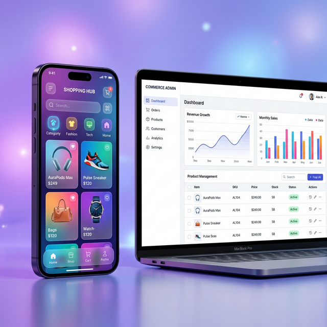

# 🛍️ Modern E-Commerce Platform



A high-performance, full-stack e-commerce solution featuring a robust **Laravel 11 REST API** with an **Admin Dashboard** and a premium **Flutter Mobile Application**.

---

## 🌟 Key Features

### 💻 Admin Dashboard (Laravel)

- **Product Management**: Add, update, and manage product inventory.
- **Order Analytics**: Real-time sales tracking with dynamic charts.
- **Inventory Control**: automated SKU management and stock status.
- **Customer Insights**: customer profiles and order history.
- **RESTful API**: Secure API endpoints for mobile integration.

### 📱 Mobile Application (Flutter)

- **Fluid User Interface**: Premium, modern design with smooth animations.
- **Dynamic Catalog**: Category-based browsing (Fashion, Tech, Home).
- **Personalized Experience**: User profiles, wishlists, and order tracking.
- **Shopping Cart**: Real-time cart management with seamless checkout.
- **Secure Authentication**: OAuth2-based login and registration.

---

## 🛠️ Technology Stack

| Component    | Technology                                                                                                          | Use Case                  |
| :----------- | :------------------------------------------------------------------------------------------------------------------ | :------------------------ |
| **Backend**  |             | API & Admin Dashboard     |
| **Mobile**   |             | Cross-platform Mobile App |
| **Database** |                   | Persistent Storage        |
| **Styling**  |  | Dashboard Design          |

---

## 📂 Project Structure

```text
ecommerce-platform/
├── backend/            # Laravel API and Admin Dashboard
│   ├── app/            # Core logic (Controllers, Models, Services)
│   ├── routes/         # API and Web routes
│   └── database/       # Migrations and Seeds
├── mobile/             # Flutter Mobile App
│   ├── lib/            # Mobile app code (Providers, UIs, Services)
│   └── assets/         # App icons and local assets
```

---

## 🚀 Getting Started

### 1. Backend Setup (Laravel)

```bash
cd backend
composer install
cp .env.example .env
php artisan key:generate
php artisan migrate --seed
php artisan serve
```

### 2. Mobile Setup (Flutter)

```bash
cd ../mobile
flutter pub get
flutter run
```

---

## 📝 License

This project is licensed under the **MIT License**.

---

_This is for practice and learning_
